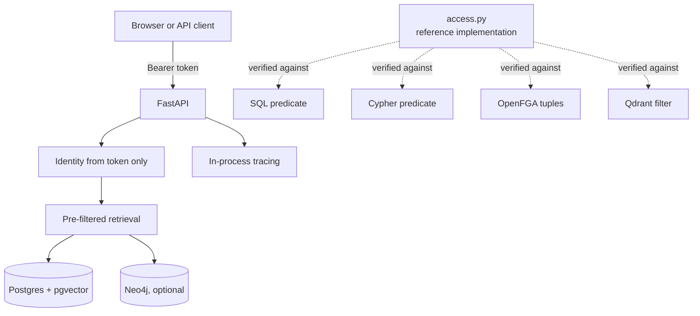
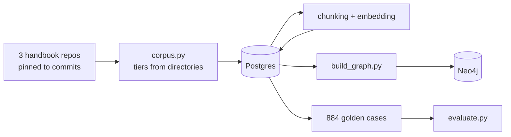

# Architecture

How ragguard is put together, and why each piece is the way it is.

For measured results see the [README](../README.md). For deployment see
[DEPLOY.md](DEPLOY.md). This document is about structure.

---

## Context

A retrieval system where the identity of the asker changes what can be
retrieved, across three tenants with four sensitivity tiers and twelve
personas.

The constraint that shapes everything: **a retrieval system cannot ask a
model to respect permissions.** By the time an instruction like "do not use
documents the user may not see" is read, the forbidden content is already in
the context window. Enforcement has to happen where rows are selected.

Two goals follow from that, and they pull against each other:

- Nothing forbidden may be returned, ever
- Filtering must not quietly degrade results for the people it protects

The second is the harder one, and the reason the evaluation harness measures
per-persona recall rather than an average.

---

## Components



| Component | Role |
| --- | --- |
| **Postgres 17 + pgvector** | Documents, chunks, 384-dim embeddings, full-text index, identity tables |
| **Neo4j 5** | Document and concept graph. Optional — search works without it |
| **OpenFGA** | Relationship-based authorization. Benchmarked and verified; not on the request path |
| **Qdrant** | Filterable-HNSW comparison. Benchmarked, then declined |
| **FastAPI** | HTTP layer, JWT identity, tracing |
| **fastembed / ONNX** | Local embeddings. No API key, no PyTorch |

---

## The policy, five times

The access rules are expressed in five places. That is a liability unless
they are proven equal, so `scripts/verify_policy_parity.py` and
`scripts/authz_benchmark.py` check every implementation against every
persona-document pair, and CI fails on any disagreement.

| Implementation | Where | Why it exists |
| --- | --- | --- |
| `access.py` | Python | The reference. Deliberately slow and obvious |
| `retrieval/filters.py` | SQL | Enforcement inside the vector search |
| `graph/filters.py` | Cypher | Enforcement inside graph traversal |
| `authz/model.py` | OpenFGA tuples | Revocation without re-indexing |
| `retrieval/qdrant_store.py` | Qdrant filter | Needed for a fair benchmark |

`access.py` is never optimised. It exists so the fast paths have something
known-correct to be diffed against, and when the evaluation reports a leak
it is the oracle that says what should have happened.

### The rules

```
1. Tenant must match.          Absolute. No clearance overrides it.
2. Clearance covers the tier.  public < internal < confidential < restricted
3. Or: a group is elevated in this document's section, which lifts it
   one tier above that group's baseline — inside that section only.
```

Order matters. Tenant is checked first and separately, because collapsing it
into the clearance comparison would make an executive look *partially*
authorised in someone else's tenant. That collapse is how cross-tenant leaks
get written.

---

## Data flow



Every stage is rebuilt from the one before it, and the corpora are pinned to
exact commits. The handbooks are live repositories: an earlier version
cloned whatever `HEAD` happened to be, and the evaluation dataset silently
stopped matching the corpus it was generated from. CI now verifies the
golden dataset regenerates byte for byte.

---

## Decisions worth knowing

**`chunks.tenant_id` is denormalised.** It is derivable through a join, but
every retrieval query filters by tenant and a join inside a filtered vector
search wrecks both recall and latency. The filter column has to live on the
row being scanned. The same principle later put ACL metadata on every graph
node and edge.

**Filtering happens during retrieval, not after.** Post-filtering — fetch
top-k, then drop what the user may not see — costs the least privileged
persona 14.3 points of recall and needs 50x oversampling to recover.
Pre-filtering spends every candidate slot on something the user can be
shown.

**Identity comes only from the token.** No endpoint accepts a persona,
tenant or clearance from a request body. If one did, changing what you can
read would be editing a JSON field.

**Tenant isolation is structural wherever possible.** Concept nodes are keyed
`tenant::name` and OpenFGA object ids are namespaced, so a GitLab group and a
PostHog document share no object and there is no path between them. A check
can be forgotten; an identifier that makes the mistake unrepresentable
cannot.

**Graph traversal checks every node on a path, not just its destination.**
Filtering only the endpoint let 5.8% of result paths — 64.3% for the least
privileged persona — route through documents the user could not read, at a
document-level leak rate of 0.0%.

**Neo4j is optional.** Search needs only Postgres, so a deployment can run
two services instead of three and the graph expansion degrades to empty
rather than taking the service down.

---

## Evaluation

The harness was built and calibrated **before any retrieval code existed**.
Building retrieval first leads to designing the evaluation around what the
system already does well.

| Metric | Definition |
| --- | --- |
| **Leak rate** | Fraction of cases returning any forbidden document. Case-level, not document-level. Target exactly 0 |
| **Recall vs ceiling** | Recall as a fraction of what is achievable at this `k` |
| **Recall parity** | Lowest-privilege recall ÷ highest-privilege recall, per tenant |
| **Transit violations** | Result paths passing through documents the user cannot read |

Three reference retrievers with predetermined scores calibrate the harness:
one returns nothing, one ignores permissions entirely, one is perfect. If
the harness cannot report catastrophic leakage for the second, nothing it
says about a real retriever means anything.

Queries are split into **local** (answerable from one document) and
**global** (needing several). Without that split there is no way to show
whether a knowledge graph earns its cost — and with it, the answer here was
that it does not.

---

## Layout

```
config/tenants.yaml     The security model: corpora, tiers, groups, personas
db/init/                SQL run once on first container start
src/ragguard/
  access.py             Reference policy implementation
  corpus.py             Filesystem to documents: frontmatter, tiers, sampling
  chunking.py           Fixed-window splitting (deliberately naive)
  embedding.py          Local ONNX embeddings
  eval/                 Golden dataset, metrics, calibration retrievers
  retrieval/            Dense, hybrid, reranking, routing, Qdrant
  graph/                Extraction, store, filters, traversal, leak audit
  authz/                OpenFGA model and client
  api/                  FastAPI, JWT, tracing
scripts/                27 scripts: build, verify, benchmark, attack
tests/                  Policy, metrics, fusion, token forgery
eval/goldens.jsonl      884 graded cases, committed and diffable
```

---

## What CI verifies

Build everything, then verify everything — in that order, because an earlier
version ran a verification step before the graph it checks had been built and
reported a missing build step as a catastrophic policy failure.

1. Lint, then unit tests (no services needed)
2. Services up, smoke test against a real database
3. Fetch corpus, seed, index, build graph, load authorization tuples
4. Policy sanity, then four-way policy parity
5. Golden dataset regenerates byte for byte
6. Harness calibration
7. Red team: eight attacks
8. API behaviour for every persona

Nothing is mocked.
